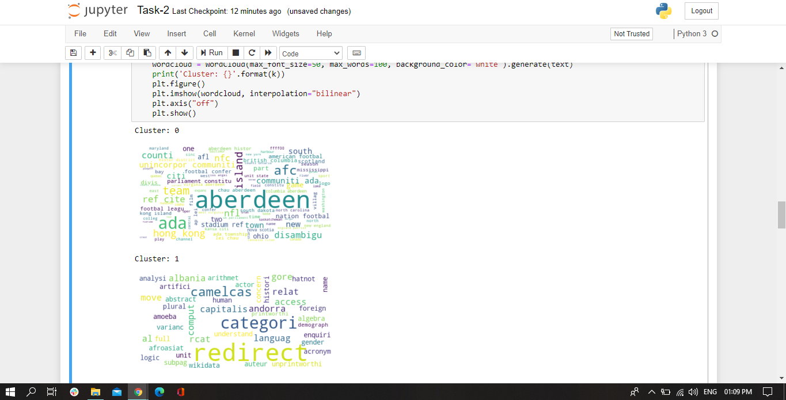
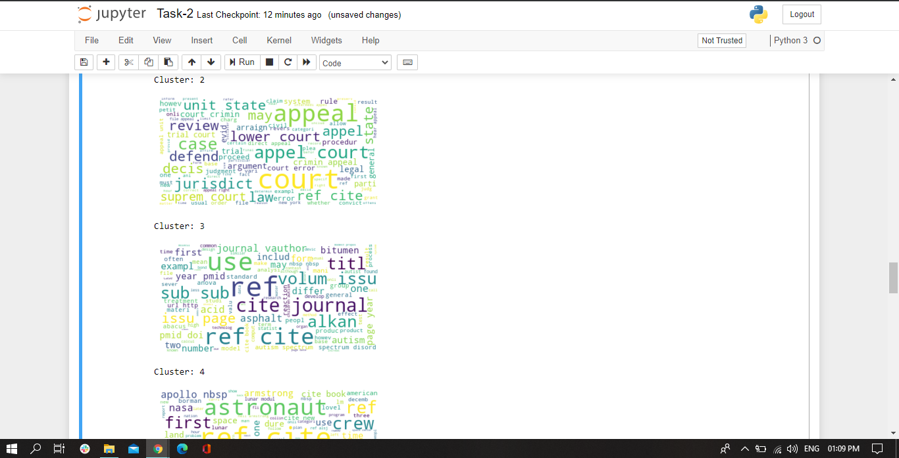
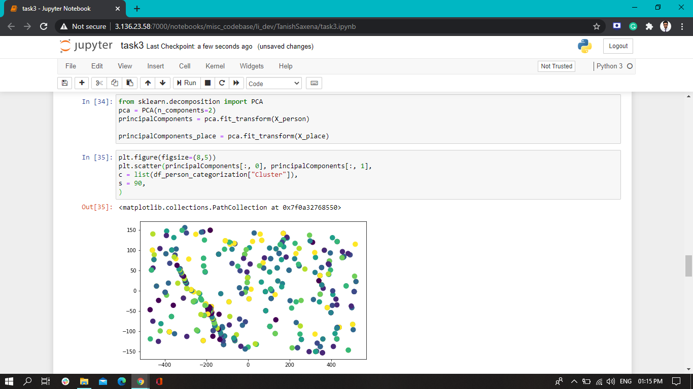

# NLPCORE-Full-Stack-NLP-Challenge

This is the solution I have written for the competition.

### Running the project:
To run this project firstly you have to install all the dependent libraries few of the main libraries mentioned below.
* NLTK
* Pandas
* Sklearn
* Spacy
* Encore-web-sm
* Flask
* Matplotlib
* Numpy

### Process to run the project:
* Clone this repository.
* Run the app.py file.
* Do npm start
* Browse to your local host.

**The project is ready to use**

### Frontend Explaination:
#### As you browse to your local host a main page will appear.

.png)

#### Then Clicking upon the 1st Button will take you to the Solution for Task 1.

.png)

.png)

#### Then again coming back to the main page clicking upon the 2nd button for task 2.

.png)
.png)

#### Then at last coming back to the main page and clicking upon the 3rd button for task 3.

.png)

.png)

### Code Flow:

Code is been divided into two parts:
* Dynamic generation scripts.
* NLP Processing Scripts.

**Dynamic Generation Scripts**
* These are the scripts which are being used for the ful stack development.
* For the **First** task I took the data and processed it in such form which contains the words along with their total frequency and the common occurence in all documents.
* For the **Second** task I took the already processed data stored in database folder in json format categorized under categories and then processed it in the form required to plot word cloud and also have given specific names to each cluster with the logic of taking top 3 most frequently ocured words and taking letters from each word like from first taking 3 letters and from second taking 2 letters and so on.
* For the **Third** task I took the already processed data stored in database folder in json format saparetly categorized undes person names and places names and plotted a scatter plot and displayed it.

**NLP Processing Scripts**
* In NLP generation scripts I have written separate code to process data.
* In **Second** task I have used Natural Language Processing tools to process data and then to categorize the documents under N categories.
  * N categories are identified using the Elbow Method.
  * K-Means Clustering Algo is being used to cluster documents.
* In **Third** task I have used NLP tools and Spacy Library to identify various places names and person names from all documents and then categorized them using the tf approach of frequency.

## Screen Shots of NLP Processing Scripts
* ### Task 2:

* ### Task 3:

# END of PROJECT 
